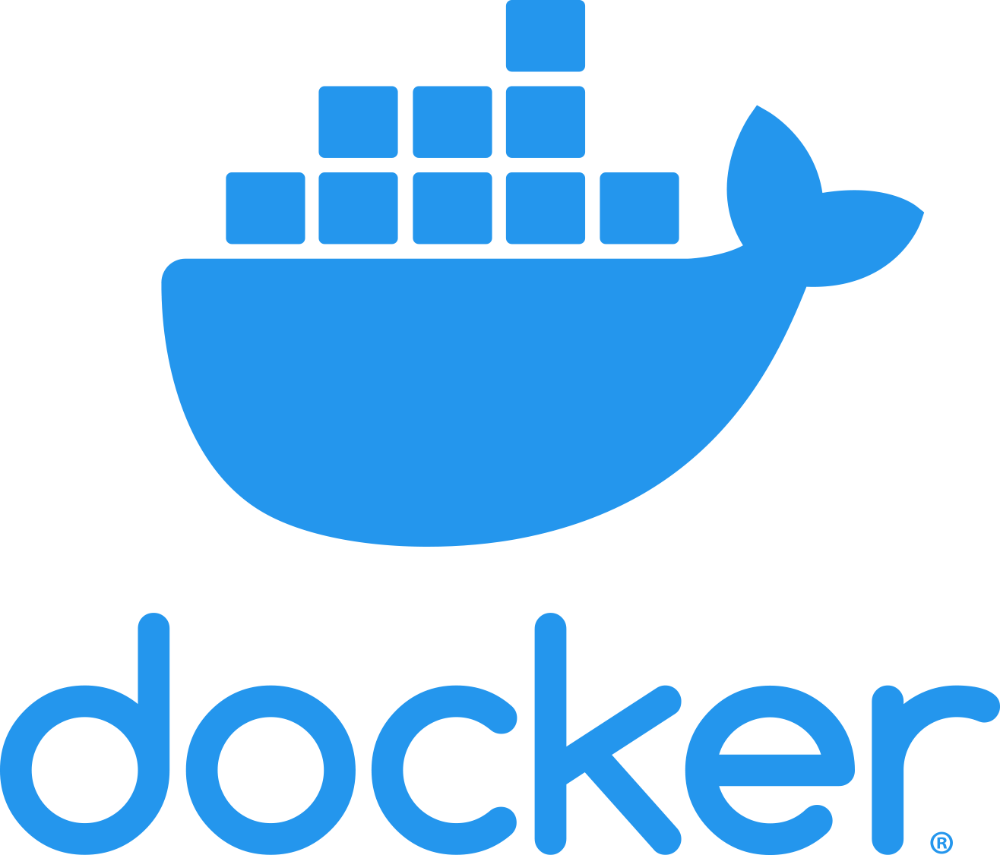

# Docker Workshop

> **時長**：2 小時
> **對象**：有 Linux 基礎，Docker 初學者
> **範例語言**：Go
> **環境需求**：已安裝 Docker Engine 及 Docker Compose

---

## 目錄

- [Docker Workshop](#docker-workshop)
  - [目錄](#目錄)
  - [Part 1：Docker 核心概念與基本操作（50 分鐘）](#part-1docker-核心概念與基本操作50-分鐘)
    - [1.1 什麼是 Docker？](#11-什麼是-docker)
      - [容器化的概念](#容器化的概念)
      - [Docker 的實際應用場景](#docker-的實際應用場景)
      - [Docker 的核心價值](#docker-的核心價值)
    - [1.2 容器 vs 虛擬機器](#12-容器-vs-虛擬機器)
      - [虛擬機器的運作方式](#虛擬機器的運作方式)
      - [容器的運作方式](#容器的運作方式)
      - [架構比較圖](#架構比較圖)
      - [詳細比較](#詳細比較)
      - [什麼時候用 VM？什麼時候用容器？](#什麼時候用-vm什麼時候用容器)
      - [容器的底層技術原理](#容器的底層技術原理)
    - [1.3 Docker 架構](#13-docker-架構)
      - [整體架構圖](#整體架構圖)
      - [各元件詳細說明](#各元件詳細說明)
      - [一個指令的完整旅程](#一個指令的完整旅程)
    - [1.4 Image 與 Container 的關係](#14-image-與-container-的關係)
      - [基本比喻](#基本比喻)
      - [Image 的分層架構（Layer）](#image-的分層架構layer)
      - [Container 的可寫層（Writable Layer）](#container-的可寫層writable-layer)
      - [多容器共用 Image](#多容器共用-image)
      - [Image Tag（標籤）](#image-tag標籤)
      - [完整的概念總結](#完整的概念總結)
    - [1.5 安裝與驗證](#15-安裝與驗證)
    - [1.6 Image 基本操作](#16-image-基本操作)
      - [搜尋映像檔](#搜尋映像檔)
      - [下載映像檔](#下載映像檔)
      - [列出本機映像檔](#列出本機映像檔)
      - [刪除映像檔](#刪除映像檔)
      - [映像檔詳細資訊](#映像檔詳細資訊)
    - [1.7 Container 基本操作](#17-container-基本操作)
      - [建立並啟動容器](#建立並啟動容器)
      - [常用 `docker run` 參數](#常用-docker-run-參數)
      - [列出容器](#列出容器)
      - [容器生命週期管理](#容器生命週期管理)
    - [1.8 Port Mapping（埠對映）](#18-port-mapping埠對映)
    - [1.9 Volume（資料掛載）](#19-volume資料掛載)
    - [1.10 Container 除錯技巧](#110-container-除錯技巧)
      - [查看日誌](#查看日誌)
      - [進入容器內部](#進入容器內部)
      - [查看容器資源使用狀況](#查看容器資源使用狀況)
      - [查看容器程序](#查看容器程序)
      - [複製檔案](#複製檔案)
    - [1.11 🔬 練習 1：執行你的第一個容器](#111--練習-1執行你的第一個容器)
  - [Part 2：Dockerfile 深入實作（35 分鐘）](#part-2dockerfile-深入實作35-分鐘)
    - [2.1 什麼是 Dockerfile？](#21-什麼是-dockerfile)
    - [2.2 Dockerfile 基礎指令](#22-dockerfile-基礎指令)
      - [FROM — 基礎映像檔](#from--基礎映像檔)
      - [COPY vs ADD](#copy-vs-add)
      - [RUN — 建置階段執行命令](#run--建置階段執行命令)
      - [CMD vs ENTRYPOINT](#cmd-vs-entrypoint)
      - [EXPOSE — 宣告埠號](#expose--宣告埠號)
      - [HEALTHCHECK — 健康檢查](#healthcheck--健康檢查)
    - [2.3 .dockerignore](#23-dockerignore)
    - [2.4 為 Go 應用撰寫 Dockerfile](#24-為-go-應用撰寫-dockerfile)
      - [基本版 Dockerfile（單階段建置）](#基本版-dockerfile單階段建置)
    - [2.5 Multi-stage Build（多階段建置）](#25-multi-stage-build多階段建置)
      - [使用 scratch 的極致精簡版](#使用-scratch-的極致精簡版)
      - [建置與執行](#建置與執行)
    - [2.6 映像檔最佳實踐](#26-映像檔最佳實踐)
      - [1. 善用 Layer Cache](#1-善用-layer-cache)
      - [2. 減少 Layer 數量](#2-減少-layer-數量)
      - [3. 使用非 root 使用者](#3-使用非-root-使用者)
      - [4. 使用 `--no-cache` 安裝套件](#4-使用---no-cache-安裝套件)
      - [5. 建置參數化](#5-建置參數化)
    - [2.7 🔬 練習 2：建置你的 Go 應用映像檔](#27--練習-2建置你的-go-應用映像檔)
  - [☕ 休息 5 分鐘](#-休息-5-分鐘)
  - [Part 3：Docker Compose 多容器編排（30 分鐘）](#part-3docker-compose-多容器編排30-分鐘)
    - [3.1 為什麼需要 Docker Compose？](#31-為什麼需要-docker-compose)
    - [3.2 docker-compose.yml 基礎語法](#32-docker-composeyml-基礎語法)
    - [3.3 服務定義詳解](#33-服務定義詳解)
      - [使用映像檔 vs 建置](#使用映像檔-vs-建置)
      - [depends\_on — 服務相依](#depends_on--服務相依)
      - [restart — 重啟策略](#restart--重啟策略)
      - [資源限制](#資源限制)
    - [3.4 Network（網路）](#34-network網路)
      - [自訂網路（進階）](#自訂網路進階)
    - [3.5 Volume（資料持久化）](#35-volume資料持久化)
    - [3.6 環境變數管理](#36-環境變數管理)
      - [方式 1：直接在 YAML 中定義](#方式-1直接在-yaml-中定義)
      - [方式 2：使用 .env 檔案](#方式-2使用-env-檔案)
      - [方式 3：使用 env\_file](#方式-3使用-env_file)
    - [3.7 常用 Compose 指令](#37-常用-compose-指令)
    - [3.8 實戰：Go API + PostgreSQL + Redis](#38-實戰go-api--postgresql--redis)
      - [目錄結構](#目錄結構)
      - [.env](#env)
      - [docker-compose.yml](#docker-composeyml)
      - [db/init.sql](#dbinitsql)
      - [api/Dockerfile](#apidockerfile)
      - [api/main.go（完整版）](#apimaingo完整版)
      - [啟動與測試](#啟動與測試)
    - [3.9 🔬 練習 3：用 Compose 部署完整服務](#39--練習-3用-compose-部署完整服務)
  - [Part 4：綜合演練與延伸學習（15 分鐘）](#part-4綜合演練與延伸學習15-分鐘)
    - [4.1 🔬 綜合練習](#41--綜合練習)
    - [4.2 常見問題排查](#42-常見問題排查)
      - [容器啟動失敗](#容器啟動失敗)
      - [容器間無法連線](#容器間無法連線)
      - [磁碟空間不足](#磁碟空間不足)
      - [映像檔建置快取問題](#映像檔建置快取問題)
      - [常見錯誤訊息](#常見錯誤訊息)
    - [4.3 延伸學習資源](#43-延伸學習資源)
      - [官方資源](#官方資源)
      - [進階主題（本次未涵蓋，建議後續學習）](#進階主題本次未涵蓋建議後續學習)
  - [附錄 A：Docker 指令速查表](#附錄-adocker-指令速查表)
    - [映像檔 (Image)](#映像檔-image)
    - [容器 (Container)](#容器-container)
    - [資料卷 (Volume)](#資料卷-volume)
    - [網路 (Network)](#網路-network)
    - [系統](#系統)
  - [附錄 B：Dockerfile 指令速查表](#附錄-bdockerfile-指令速查表)
  - [附錄 C：Docker Compose 速查表](#附錄-cdocker-compose-速查表)

---

## Part 1：Docker 核心概念與基本操作（50 分鐘）

### 1.1 什麼是 Docker？

#### 容器化的概念



在理解 Docker 之前，先來聊聊「容器化（Containerization）」這個概念。

我們通常會跟多個人一起協作一個專案，在專案運作過程中切換機器（比方説換一台電腦、準備部署產品）但每台機器的作業系統、程式語言版本，套件版本，容易有落差，不同作業系統的工作路徑和程式寫法會有差別，不同套件版本會有相依性（Dependency）問題，這樣就會導致同樣的程式在不同的環境下無法運作。
叫另一個開發者一步一步安裝出項目所需的環境是一個地獄 :(

```
┌─────────────────────────────────────────────────────┐
│  開發者的電腦          其他人的電腦                     │
│  ┌──────────┐        ┌──────────┐                   │
│  │ Go 1.23  │   →    │ Go 1.21  │  ← 版本不一致！     │
│  │ MacOs    │   →    │ CentOS   │  ← 作業系統不同！   │
│  │ libssl 3 │   →    │ libssl 1 │  ← 函式庫不同！     │
│  └──────────┘        └──────────┘                   │
└─────────────────────────────────────────────────────┘
```

Docker 就是軟體世界的「貨櫃系統」，把應用程式和它需要的環境（小型作業系統、程式語言、函式庫、設定檔）打包成一個標準化的映像檔，隔絕使用者的機器，當其他電腦拿到這個整包的檔案後，，在自己稱為 **容器化（Containerization）**，

Docker 的解法是：**把應用程式和環境一起打包成不可變的**。

```
┌─────────────────────────────────────────────────────┐
│                 Docker 的解法                         │
├─────────────────────────────────────────────────────┤
│                                                     │
│  Docker Image（不可變的打包成品）                      │
│  ┌─────────────────────────┐                        │
│  │  你的 Go 應用程式         │                        │
│  │  Go Runtime              │                        │
│  │  所有相依套件             │                        │
│  │  作業系統基礎層           │                        │
│  └─────────────────────────┘                        │
│       │              │              │                │
│       ▼              ▼              ▼                │
│  開發者電腦       測試環境       正式環境              │
│  （行為一致）    （行為一致）   （行為一致）            │
│                                                     │
└─────────────────────────────────────────────────────┘
```

#### Docker 的實際應用場景

在日常工作中，Docker 最常見的使用場景有：

**場景 1：統一開發環境**

新人報到第一天，不需要花一整天安裝各種工具和設定環境。只需要 `docker compose up`，整個開發環境（資料庫、快取、訊息佇列）就全部起來了，而且跟團隊其他人完全一致。

**場景 2：CI/CD 持續整合**

每次程式碼推送到 Git，CI 系統自動建置 Docker 映像檔、執行測試，通過後直接部署到正式環境。因為映像檔是不可變的，在 CI 測試通過的映像檔跟部署到正式環境的是同一個。

**場景 3：微服務架構**

一個大型應用拆成多個小服務，每個服務獨立開發、獨立部署。每個服務打包成各自的映像檔，用不同的語言、不同的框架都沒問題，因為它們在各自的容器裡互不干擾。

**場景 4：快速實驗與學習**

想試試 PostgreSQL 17 的新功能？`docker run postgres:17-alpine` 就搞定了，用完即丟。不需要安裝、不需要設定、不會汙染你的系統。

#### Docker 的核心價值

| 價值 | 說明 | 實際影響 |
|------|------|---------|
| **一致性** | 開發、測試、正式環境完全相同 | 不再有「在我電腦上可以跑」的問題 |
| **隔離性** | 每個容器互相隔離，不會互相影響 | 應用 A 升級函式庫不會搞壞應用 B |
| **可攜性** | 一次打包，到處執行 | 同一個映像檔可以跑在任何有 Docker 的機器 |
| **輕量化** | 共用宿主機核心，啟動僅需數秒 | 一台機器可以跑幾十甚至上百個容器 |
| **版本控制** | 映像檔可標記版本，方便回溯 | 上線出問題？直接切回上一版映像檔 |
| **可重複性** | Dockerfile 定義了完整的建置流程 | 任何人、任何時候都能重現同樣的結果 |

---

### 1.2 容器 vs 虛擬機器

要理解容器，最好的方式是跟它的「前輩」虛擬機器（VM）做比較。兩者都是為了解決「隔離」和「資源管理」的問題，但做法截然不同。

#### 虛擬機器的運作方式

虛擬機器透過 **Hypervisor**（虛擬機管理程式）在硬體上模擬出多台「假電腦」。每台虛擬機器都有自己完整的作業系統——從核心到使用者空間，一應俱全。

你可以把虛擬機器想成是「在電腦裡面再裝幾台電腦」。就像你買了一棟大樓，每一層都是一個完全獨立的公寓——有自己的水電管路、自己的門牌。隔離性很好，但每一層都要重複裝設相同的基礎設施，非常浪費空間。

常見的 Hypervisor 有 VMware ESXi、KVM、Microsoft Hyper-V。

#### 容器的運作方式

容器不模擬硬體，而是利用 Linux 核心本身的功能（Namespace + Cgroup）來隔離程序。所有容器共用同一個宿主機核心，每個容器只包含應用程式和它需要的函式庫。

延續上面的比喻：容器就像是一棟大樓裡的共享辦公空間（co-working space）。大家共用水電、網路、電梯等基礎設施，但每個團隊有自己隔開的辦公區域，互不干擾。省空間、啟動快、但隔離性不如獨立公寓那麼強。

#### 架構比較圖

```
┌──────────────────────────────┬──────────────────────────────┐
│        虛擬機器 (VM)          │        容器 (Container)       │
├──────────────────────────────┼──────────────────────────────┤
│                              │                              │
│  ┌────────┐  ┌────────┐     │  ┌────────┐  ┌────────┐     │
│  │ App A  │  │ App B  │     │  │ App A  │  │ App B  │     │
│  ├────────┤  ├────────┤     │  ├────────┤  ├────────┤     │
│  │ Bins/  │  │ Bins/  │     │  │ Bins/  │  │ Bins/  │     │
│  │ Libs   │  │ Libs   │     │  │ Libs   │  │ Libs   │     │
│  ├────────┤  ├────────┤     │  └────┬───┘  └───┬────┘     │
│  │Guest OS│  │Guest OS│     │       │          │           │
│  └────┬───┘  └───┬────┘     │  ┌────┴──────────┴────┐     │
│  ┌────┴──────────┴────┐     │  │   Docker Engine     │     │
│  │    Hypervisor      │     │  ├─────────────────────┤     │
│  ├────────────────────┤     │  │     Host OS         │     │
│  │     Host OS        │     │  ├─────────────────────┤     │
│  ├────────────────────┤     │  │    Infrastructure   │     │
│  │   Infrastructure   │     │  └─────────────────────┘     │
│  └────────────────────┘     │                              │
│                              │                              │
└──────────────────────────────┴──────────────────────────────┘
```

注意右邊容器的架構——**沒有 Guest OS 那一層**。這就是容器輕量化的根本原因。

#### 詳細比較

| 比較項目 | 虛擬機器 (VM) | 容器 (Container) |
|---------|--------------|-----------------|
| **隔離方式** | 硬體層虛擬化 (Hypervisor) | 作業系統層虛擬化 (Namespace + Cgroup) |
| **Guest OS** | 每台 VM 都有完整的 OS | 共用宿主機核心，無需 Guest OS |
| **啟動時間** | 分鐘級（需要開機） | 秒級（只是啟動一個程序） |
| **映像檔大小** | GB 級（包含完整 OS） | MB 級（只包含 App + Libs） |
| **資源佔用** | 高（每台都要分配 CPU、記憶體給 OS） | 低（共用核心，按需分配） |
| **隔離程度** | 強（完整硬體隔離） | 較弱（共用核心，靠 Namespace 隔離） |
| **密度** | 一台伺服器通常跑幾台~幾十台 VM | 一台伺服器可以跑幾十~幾百個容器 |
| **適用場景** | 需要強隔離、不同 OS、遺留系統 | 微服務、CI/CD、快速部署、開發環境 |

#### 什麼時候用 VM？什麼時候用容器？

這不是二選一的問題——在實務中，兩者經常搭配使用。例如：在雲端平台上開一台 VM（EC2 / GCE），在 VM 裡面跑 Docker 容器。

**適合用 VM 的場景：**
- 需要跑不同的作業系統（例如在 Linux 上跑 Windows）
- 需要硬體等級的隔離（多租戶環境、金融合規要求）
- 遺留系統無法容器化

**適合用容器的場景：**
- 微服務架構
- CI/CD 流水線
- 開發與測試環境
- 需要快速橫向擴展（scale out）的應用

#### 容器的底層技術原理

容器不是魔法，它是利用 Linux 核心已有的功能實現隔離。主要依賴三大技術：

**1. Namespace（命名空間）— 隔離「看到什麼」**

Namespace 讓每個容器以為自己是系統上唯一的程序。就像是給每個容器戴上不同的「有色眼鏡」，讓它只能看到屬於自己的資源。

| Namespace 類型 | 隔離的內容 | 效果 |
|---------------|-----------|------|
| **PID** | 程序 ID | 容器內的程序以為自己是 PID 1（第一個程序） |
| **Network** | 網路介面、IP、路由 | 每個容器有自己的網路堆疊和 IP 位址 |
| **Mount** | 檔案系統掛載點 | 容器只能看到自己的檔案系統 |
| **UTS** | 主機名稱 | 每個容器可以有自己的 hostname |
| **IPC** | 跨程序通訊 | 容器間的 IPC 互相隔離 |
| **User** | 使用者/群組 ID | 容器內的 root 不等於宿主機的 root |
| **Cgroup** | Cgroup 階層 | 容器只能看到自己的資源限制 |

舉個例子：在宿主機上用 `ps aux` 可以看到所有程序，但在容器裡面用 `ps aux` 只能看到容器自己的程序。這就是 PID Namespace 的效果。

**2. Cgroup（Control Group）— 限制「用多少」**

Namespace 管的是「看到什麼」，Cgroup 管的是「能用多少」。它限制每個容器可以使用的系統資源：

| 資源 | 說明 | 範例 |
|------|------|------|
| **CPU** | 限制 CPU 使用量 | 最多用 1.5 個 CPU 核心 |
| **Memory** | 限制記憶體使用量 | 最多用 512MB，超過就 OOM Kill |
| **I/O** | 限制磁碟讀寫速度 | 讀寫速度上限 100MB/s |
| **Network** | 限制網路頻寬 | 上行/下行各 100Mbps |

這就像是合租房子時的公平使用規則：你可以用廚房，但不能一個人把整個冰箱佔滿。

**3. Union Filesystem（聯合檔案系統）— 管理「存什麼」**

Union Filesystem（如 OverlayFS）讓多個目錄「疊加」在一起呈現為一個統一的檔案系統。這是 Docker 映像檔分層架構的基礎，我們在 1.4 節會詳細說明。

```
┌───────────────────────────────────────────────────────┐
│              容器的三大底層技術                          │
├───────────────────────────────────────────────────────┤
│                                                       │
│  ┌─────────────┐  ┌─────────────┐  ┌──────────────┐  │
│  │  Namespace  │  │   Cgroup    │  │ Union FS     │  │
│  │             │  │             │  │              │  │
│  │ 隔離可見性   │  │ 限制資源量   │  │ 管理檔案系統  │  │
│  │ 「看到什麼」 │  │ 「用多少」   │  │ 「存什麼」   │  │
│  └─────────────┘  └─────────────┘  └──────────────┘  │
│         │                │                │           │
│         └────────────────┼────────────────┘           │
│                          ▼                            │
│                 ┌─────────────────┐                   │
│                 │   Linux Kernel  │                   │
│                 └─────────────────┘                   │
│                                                       │
│  重點：這些都是 Linux 核心的原生功能，不是 Docker 發明的。  │
│  Docker 的貢獻是把它們封裝成簡單好用的工具。              │
│                                                       │
└───────────────────────────────────────────────────────┘
```

> 💡 容器並不是一個完全獨立的虛擬機器，而是利用核心功能「隔離」出來的程序。在宿主機上用 `ps aux` 可以看到容器裡的程序——它們就是一般的 Linux 程序，只是被 Namespace 和 Cgroup 「圍」起來了。

---

### 1.3 Docker 架構

Docker 採用 **Client-Server 架構**，由多個元件協作完成容器的管理。理解這些元件有助於你排查問題和理解 Docker 的行為。

#### 整體架構圖

```
┌──────────────────────────────────────────────────────────────────┐
│                         Docker 架構                                │
├──────────────────────────────────────────────────────────────────┤
│                                                                  │
│  ┌──────────────┐                                                │
│  │ Docker CLI   │  你在終端機打的指令                               │
│  │ (Client)     │                                                │
│  │              │                                                │
│  │ docker run   │                                                │
│  │ docker build │                                                │
│  │ docker pull  │                                                │
│  └──────┬───────┘                                                │
│         │  REST API（通常透過 Unix Socket）                        │
│         ▼                                                        │
│  ┌──────────────────────────────────────────┐                    │
│  │          Docker Daemon (dockerd)         │                    │
│  │                                          │                    │
│  │  接收 Client 指令，協調所有 Docker 操作     │                    │
│  │                                          │                    │
│  │  ┌──────────┐ ┌──────────┐ ┌──────────┐ │                    │
│  │  │ Image    │ │ Network  │ │ Volume   │ │                    │
│  │  │ 管理     │ │ 管理     │ │ 管理     │ │                    │
│  │  └──────────┘ └──────────┘ └──────────┘ │                    │
│  └──────────────────┬───────────────────────┘                    │
│                     │                                            │
│                     ▼                                            │
│  ┌──────────────────────────────────────────┐                    │
│  │            containerd                    │                    │
│  │                                          │                    │
│  │  高階容器執行時期：管理容器生命週期          │                    │
│  │  (拉取映像檔、建立容器、管理儲存和網路)      │                    │
│  └──────────────────┬───────────────────────┘                    │
│                     │                                            │
│                     ▼                                            │
│  ┌──────────────────────────────────────────┐                    │
│  │              runc                        │                    │
│  │                                          │                    │
│  │  低階容器執行時期（OCI 標準實作）           │                    │
│  │  實際呼叫 Linux Namespace/Cgroup 建立容器  │                    │
│  └──────────────────────────────────────────┘                    │
│                                                                  │
│                     ▲                                            │
│                     │ 拉取映像檔                                  │
│                     ▼                                            │
│  ┌──────────────────────────────────────────┐                    │
│  │          Docker Registry                 │                    │
│  │          (Docker Hub 等)                  │                    │
│  │                                          │                    │
│  │  存放和分發映像檔的倉庫                     │                    │
│  │  nginx, postgres, redis, golang, alpine  │                    │
│  └──────────────────────────────────────────┘                    │
│                                                                  │
└──────────────────────────────────────────────────────────────────┘
```

#### 各元件詳細說明

**Docker Client（用戶端）**

就是你在終端機輸入的 `docker` 命令。它本身不做任何容器管理，只負責把你的指令轉成 REST API 請求，傳送給 Docker Daemon。

Client 和 Daemon 之間預設透過 Unix Socket（`/var/run/docker.sock`）通訊。這代表它們通常在同一台機器上，但你也可以透過 TCP 連線遠端的 Docker Daemon。

```bash
# 看看 Docker Client 和 Server (Daemon) 的版本
docker version

# Client 的設定
# Client:
#  Version:    27.x.x
#
# Server (Daemon) 的設定
# Server:
#  Engine:
#   Version:   27.x.x
```

**Docker Daemon（dockerd，背景服務程序）**

Docker 的大腦。它是一個常駐的背景程序，接收 Client 的 API 請求，負責協調映像檔管理、容器建立、網路設定、儲存管理等所有操作。

當你執行 `docker run nginx` 時，Daemon 做了這些事：
1. 檢查本機有沒有 `nginx` 映像檔
2. 沒有的話，從 Registry 下載
3. 請 containerd 建立並啟動容器
4. 設定網路（分配 IP、建立 bridge）
5. 掛載 Volume（如果有指定）
6. 回報結果給 Client

**containerd（容器執行時期）**

Docker Daemon 底下的容器生命週期管理者。它負責：
- 拉取和推送映像檔
- 管理容器的建立、啟動、停止、刪除
- 管理映像檔的儲存

containerd 是 CNCF（Cloud Native Computing Foundation）的畢業專案，Kubernetes 也可以直接使用 containerd 而不需要 Docker。

**runc（低階容器執行時期）**

真正建立容器的工具。它根據 OCI（Open Container Initiative）規格，呼叫 Linux 核心的 Namespace 和 Cgroup 來建立隔離的程序。runc 是最底層的元件，完成工作後就退出，容器直接由作業系統管理。

**Docker Registry（映像檔倉庫）**

存放和分發映像檔的地方，類似程式碼的 GitHub。

| Registry | 說明 |
|----------|------|
| **Docker Hub** | 官方公開倉庫，有大量社群映像檔（預設） |
| **GitHub Container Registry (ghcr.io)** | GitHub 提供的映像檔倉庫 |
| **Amazon ECR** | AWS 的私有映像檔倉庫 |
| **Google Artifact Registry** | GCP 的映像檔倉庫 |
| **Harbor** | 開源的自建映像檔倉庫，常用於企業內部 |

#### 一個指令的完整旅程

讓我們追蹤 `docker run nginx` 從輸入到容器啟動的完整流程：

```
┌─────────────────────────────────────────────────────────────┐
│  docker run nginx 的完整旅程                                  │
├─────────────────────────────────────────────────────────────┤
│                                                             │
│  1. 你輸入 docker run nginx                                  │
│     │                                                       │
│     ▼                                                       │
│  2. Docker CLI 將指令轉成 REST API 請求                       │
│     POST /containers/create + POST /containers/{id}/start   │
│     │                                                       │
│     ▼                                                       │
│  3. Docker Daemon 收到請求                                   │
│     ├─→ 本機有 nginx 映像檔嗎？                               │
│     │   ├─ 有 → 直接用                                       │
│     │   └─ 沒有 → 從 Docker Hub 下載                         │
│     │                                                       │
│     ▼                                                       │
│  4. Daemon 請 containerd 建立容器                             │
│     │                                                       │
│     ▼                                                       │
│  5. containerd 請 runc 建立容器程序                           │
│     │                                                       │
│     ▼                                                       │
│  6. runc 呼叫核心 API：                                      │
│     ├─ 建立 Namespace（PID、Network、Mount...）              │
│     ├─ 設定 Cgroup（資源限制）                                │
│     ├─ 掛載 Union Filesystem                                 │
│     └─ 啟動容器內的程序（nginx）                              │
│     │                                                       │
│     ▼                                                       │
│  7. 容器啟動完成，nginx 開始運作                               │
│     runc 退出，容器由核心直接管理                              │
│                                                             │
└─────────────────────────────────────────────────────────────┘
```

> 💡 **macOS 和 Windows 的特殊情況**：Docker 容器需要 Linux 核心。在 macOS 和 Windows 上，Docker Desktop 會在背景執行一台輕量 Linux VM（使用 Apple Hypervisor Framework 或 Hyper-V），Docker Daemon 跑在這台 VM 裡面。所以在 macOS 上，你的容器其實是跑在一台隱藏的 Linux VM 中。

---

### 1.4 Image 與 Container 的關係

Image（映像檔）和 Container（容器）是 Docker 最核心的兩個概念。許多初學者會混淆它們，所以讓我們用多個角度來理解。

#### 基本比喻

可以用很多方式來比喻 Image 和 Container 的關係：

| 比喻 | Image（映像檔） | Container（容器） |
|------|----------------|-------------------|
| **程式設計** | Class（類別定義） | Instance（實體物件） |
| **烘焙** | 食譜 + 模具 | 依照食譜做出來的蛋糕 |
| **音樂** | CD 母帶 | 播放中的音樂 |
| **建築** | 建築藍圖 | 蓋好的房子 |
| **作業系統** | ISO 安裝映像檔 | 安裝好的系統 |

**重點是**：Image 是靜態的、唯讀的「定義」，Container 是動態的、可讀寫的「執行實體」。一個 Image 可以產生無限多個 Container，就像一個 Class 可以 `new()` 出無限多個 Instance。

#### Image 的分層架構（Layer）

Docker Image 不是一個巨大的單一檔案，而是由多個**唯讀的 Layer（層）**堆疊而成。每一個 Dockerfile 指令（`FROM`、`RUN`、`COPY` 等）都會建立一個新的 Layer。

```
┌────────────────────────────────────────────────────────────┐
│                Image 的分層結構                               │
├────────────────────────────────────────────────────────────┤
│                                                            │
│  Dockerfile 指令                    對應的 Layer             │
│                                                            │
│  FROM golang:1.24-alpine    →    ┌──────────────────────┐  │
│                                  │ Layer 1: 基礎映像檔    │  │
│                                  │ (Alpine + Go 工具鏈)   │  │
│                                  │ 大小: ~270MB           │  │
│  COPY go.mod go.sum ./      →    ├──────────────────────┤  │
│                                  │ Layer 2: 相依定義檔    │  │
│                                  │ 大小: ~5KB             │  │
│  RUN go mod download        →    ├──────────────────────┤  │
│                                  │ Layer 3: 下載的套件    │  │
│                                  │ 大小: ~50MB            │  │
│  COPY . .                   →    ├──────────────────────┤  │
│                                  │ Layer 4: 你的原始碼    │  │
│                                  │ 大小: ~1MB             │  │
│  RUN go build -o server .   →    ├──────────────────────┤  │
│                                  │ Layer 5: 編譯產物      │  │
│                                  │ 大小: ~15MB            │  │
│                                  └──────────────────────┘  │
│                                                            │
│  所有 Layer 都是唯讀的（Read-Only）                          │
│                                                            │
└────────────────────────────────────────────────────────────┘
```

**為什麼要分層？有三個重大好處：**

**好處 1：快取（Cache）加速建置**

Docker 在建置映像檔時，如果發現某一層的指令和輸入都沒有改變，就直接使用上次的結果（快取），不需要重新執行。例如你只改了一行 Go 原始碼，Layer 1~3 都可以用快取，只需要重新執行 Layer 4 和 5。

**好處 2：共用（Sharing）節省磁碟空間**

如果你有 10 個映像檔都是基於 `alpine:3.21`，Alpine 那一層只需要在磁碟上存一份。這就是為什麼 `docker images` 顯示的總大小可能比實際佔用的磁碟空間大——因為共用的 Layer 只算一次。

**好處 3：傳輸（Transfer）效率**

推送或拉取映像檔時，只需要傳輸對方沒有的 Layer。如果 Docker Hub 上已經有 `alpine:3.21` 的 Layer，你只需要上傳你的應用程式 Layer 就好。

#### Container 的可寫層（Writable Layer）

當你從 Image 建立一個 Container 時，Docker 會在 Image 的所有唯讀層之上加一個**可讀寫的 Container Layer**：

```
┌────────────────────────────────────────────────────────────┐
│                Container = Image + 可寫層                    │
├────────────────────────────────────────────────────────────┤
│                                                            │
│  ┌──────────────────────────────────────────────┐          │
│  │  Container Layer（可讀寫）                     │          │
│  │                                              │          │
│  │  容器執行期間所有的修改都寫在這一層：            │          │
│  │  - 新建立的檔案                               │          │
│  │  - 修改的設定檔                               │          │
│  │  - 應用程式寫入的日誌                          │          │
│  │  - 暫存資料                                   │          │
│  │                                              │          │
│  │  ⚠️ 容器刪除時，這一層就消失了！                │          │
│  ├──────────────────────────────────────────────┤          │
│  │  Layer 5: go build（唯讀）                    │          │
│  ├──────────────────────────────────────────────┤          │
│  │  Layer 4: COPY . .（唯讀）                    │   Image  │
│  ├──────────────────────────────────────────────┤  Layers  │
│  │  Layer 3: go mod download（唯讀）             │ (共用的)  │
│  ├──────────────────────────────────────────────┤          │
│  │  Layer 2: COPY go.mod（唯讀）                 │          │
│  ├──────────────────────────────────────────────┤          │
│  │  Layer 1: golang:1.24-alpine（唯讀）          │          │
│  └──────────────────────────────────────────────┘          │
│                                                            │
└────────────────────────────────────────────────────────────┘
```

**Copy-on-Write（寫入時複製）機制：**

當容器需要修改 Image Layer 中的檔案時（例如修改 `/etc/nginx/nginx.conf`），Docker 不會直接修改唯讀的 Layer，而是：

1. 從唯讀 Layer 複製該檔案到可寫層
2. 在可寫層修改這份副本
3. 之後容器讀取該檔案時，就會使用可寫層的版本

這個機制叫做 **Copy-on-Write（CoW）**，確保了 Image 的不可變性——不管有多少容器在跑，底層的 Image Layer 永遠不會被修改。

#### 多容器共用 Image

```
┌────────────────────────────────────────────────────────────┐
│                 多容器共用同一個 Image                        │
├────────────────────────────────────────────────────────────┤
│                                                            │
│  Container A          Container B          Container C     │
│  ┌──────────┐        ┌──────────┐        ┌──────────┐     │
│  │ 可寫層 A  │        │ 可寫層 B  │        │ 可寫層 C  │     │
│  │ (日誌、   │        │ (不同的   │        │ (各自獨   │     │
│  │  暫存等)  │        │  資料)    │        │  立的)    │     │
│  └─────┬────┘        └─────┬────┘        └─────┬────┘     │
│        │                   │                   │           │
│        └───────────────────┼───────────────────┘           │
│                            ▼                               │
│              ┌──────────────────────┐                      │
│              │  共用的 Image Layers  │                      │
│              │  (唯讀，只存一份)      │                      │
│              │                      │                      │
│              │  Layer 5: app        │                      │
│              │  Layer 4: deps       │                      │
│              │  Layer 3: runtime    │                      │
│              │  Layer 2: libs       │                      │
│              │  Layer 1: base OS    │                      │
│              └──────────────────────┘                      │
│                                                            │
│  三個容器共用同一份 Image（~300MB），各自的可寫層可能只有幾 MB  │
│  總磁碟佔用 ≈ 300MB + 幾 MB × 3，而不是 300MB × 3           │
│                                                            │
└────────────────────────────────────────────────────────────┘
```

這個設計非常高效——跑 100 個同一映像檔的容器，磁碟上 Image 部分的資料只需要存一份。

#### Image Tag（標籤）

每個映像檔可以有多個 Tag，用來區分不同版本。Tag 的命名格式是 `<repository>:<tag>`。

```
┌────────────────────────────────────────────────────────────┐
│                    Image 命名格式                            │
├────────────────────────────────────────────────────────────┤
│                                                            │
│  完整格式：                                                  │
│  [registry/][username/]repository[:tag]                     │
│                                                            │
│  範例：                                                     │
│  docker.io/library/nginx:1.27-alpine                       │
│  ├────────┘ ├─────┘ ├───┘ ├─────────┘                      │
│  │          │       │     └─ Tag（版本標記）                  │
│  │          │       └─ Repository（映像檔名稱）              │
│  │          └─ Username（官方映像檔為 library，通常省略）      │
│  └─ Registry（預設 docker.io，通常省略）                     │
│                                                            │
│  所以 nginx:1.27-alpine 完整寫法是                           │
│  docker.io/library/nginx:1.27-alpine                       │
│                                                            │
│  常見 Tag 慣例：                                             │
│  nginx:latest        → 最新版（不建議正式環境使用）           │
│  nginx:1.27          → 主要版本                              │
│  nginx:1.27.3        → 精確版本（正式環境建議使用）           │
│  nginx:1.27-alpine   → 基於 Alpine 的精簡版                 │
│  nginx:1.27-bookworm → 基於 Debian Bookworm 的版本          │
│                                                            │
└────────────────────────────────────────────────────────────┘
```

> ⚠️ **重要**：`latest` 只是一個普通的 Tag 名稱，不保證是最新版。它是沒有指定 Tag 時的預設值。在正式環境中，**務必使用明確的版本號**（如 `nginx:1.27.3`），避免因為映像檔更新導致意外問題。

#### 完整的概念總結

| 概念 | Image（映像檔） | Container（容器） |
|------|----------------|-------------------|
| **性質** | 唯讀模板，由多個 Layer 組成 | 可讀寫的執行實體，Image + 可寫層 |
| **生命週期** | 建置後不可變（Immutable） | 可建立、啟動、暫停、停止、刪除 |
| **儲存** | 分層結構，跨映像檔可共用 | 可寫層存放執行期間的變更 |
| **可重複性** | 同一 Dockerfile 永遠建出一樣的 Image | 每個 Container 的可寫層內容可能不同 |
| **數量關係** | 一個 Image 可以產生多個 Container | 一個 Container 只對應一個 Image |
| **資料持久性** | 除非刪除映像檔，否則永久存在 | 可寫層隨容器刪除而消失（需 Volume 持久化） |

---

### 1.5 安裝與驗證

**macOS（使用 Docker Desktop 或 OrbStack）：**

```bash
# 驗證安裝
docker version

# 查看 Docker 系統資訊
docker info

# 執行測試容器
docker run hello-world
```

**預期輸出（hello-world）：**

```
Hello from Docker!
This message shows that your installation appears to be working correctly.
...
```

如果你看到這段訊息，恭喜！Docker 已經成功安裝。

`docker run hello-world` 背後發生了什麼事？

```
┌──────────────────────────────────────────────────────┐
│  docker run hello-world 的完整流程                     │
├──────────────────────────────────────────────────────┤
│                                                      │
│  1. Docker Client 傳送指令給 Docker Daemon            │
│                    │                                 │
│                    ▼                                 │
│  2. Daemon 在本地尋找 hello-world 映像檔               │
│                    │                                 │
│                    ▼ （找不到）                        │
│  3. 從 Docker Hub 下載 hello-world 映像檔              │
│                    │                                 │
│                    ▼                                 │
│  4. 用映像檔建立一個新的 Container                     │
│                    │                                 │
│                    ▼                                 │
│  5. Container 執行程式，輸出訊息                       │
│                    │                                 │
│                    ▼                                 │
│  6. 程式結束，Container 停止（但不會自動刪除）           │
│                                                      │
└──────────────────────────────────────────────────────┘
```

---

### 1.6 Image 基本操作

#### 搜尋映像檔

```bash
# 從 Docker Hub 搜尋映像檔
docker search nginx

# 通常建議直接到 Docker Hub 網站搜尋，資訊更完整
# https://hub.docker.com
```

#### 下載映像檔

```bash
# 下載最新版（:latest 標籤）
docker pull nginx

# 下載特定版本
docker pull nginx:1.27

# 下載特定平台版本
docker pull --platform linux/amd64 nginx:1.27

# 下載 Alpine 精簡版（建議優先使用，映像檔更小）
docker pull nginx:1.27-alpine
```

> 💡 **Tag（標籤）** 是映像檔的版本標記。`latest` 不一定代表最新版，它只是預設標籤。正式環境務必指定明確版本號。

#### 列出本機映像檔

```bash
# 列出所有映像檔
docker images

# 輸出範例：
# REPOSITORY   TAG           IMAGE ID       CREATED       SIZE
# nginx        1.27-alpine   a2bd6dc6e5e6   2 weeks ago   43.3MB
# nginx        1.27          39286ab8a5e1   2 weeks ago   192MB
# hello-world  latest        d2c94e258dcb   9 months ago  13.3kB
```

注意 `nginx:1.27-alpine`（43MB） 與 `nginx:1.27`（192MB） 的大小差異！

#### 刪除映像檔

```bash
# 刪除指定映像檔
docker rmi nginx:1.27

# 強制刪除（即使有停止的容器正在使用）
docker rmi -f nginx:1.27

# 刪除所有未使用的映像檔（dangling images）
docker image prune

# 刪除所有未被容器使用的映像檔
docker image prune -a
```

#### 映像檔詳細資訊

```bash
# 查看映像檔詳細資訊（層數、環境變數等）
docker inspect nginx:1.27-alpine

# 查看映像檔的建置歷史（每一層的指令）
docker history nginx:1.27-alpine
```

---

### 1.7 Container 基本操作

#### 建立並啟動容器

```bash
# 基本語法
docker run [OPTIONS] IMAGE [COMMAND] [ARG...]

# 前景模式執行（Ctrl+C 可停止）
docker run nginx:1.27-alpine

# 背景模式執行（-d = detach）
docker run -d nginx:1.27-alpine

# 指定容器名稱（--name）
docker run -d --name my-nginx nginx:1.27-alpine

# 執行後自動刪除容器（--rm，適合一次性任務）
docker run --rm nginx:1.27-alpine nginx -v
```

#### 常用 `docker run` 參數

| 參數 | 說明 | 範例 |
|------|------|------|
| `-d` | 背景執行 (detach) | `docker run -d nginx` |
| `--name` | 命名容器 | `docker run --name web nginx` |
| `-p` | 埠對映 (host:container) | `docker run -p 8080:80 nginx` |
| `-v` | 掛載資料卷 | `docker run -v /data:/app/data nginx` |
| `-e` | 設定環境變數 | `docker run -e DB_HOST=db nginx` |
| `--rm` | 停止後自動刪除 | `docker run --rm nginx` |
| `-it` | 互動式終端 | `docker run -it ubuntu bash` |
| `--restart` | 重啟策略 | `docker run --restart=unless-stopped nginx` |
| `--network` | 指定網路 | `docker run --network=mynet nginx` |
| `--memory` | 記憶體限制 | `docker run --memory=512m nginx` |
| `--cpus` | CPU 限制 | `docker run --cpus=1.5 nginx` |

#### 列出容器

```bash
# 列出執行中的容器
docker ps

# 列出所有容器（包含已停止的）
docker ps -a

# 只顯示容器 ID
docker ps -q

# 輸出範例：
# CONTAINER ID   IMAGE               STATUS          PORTS                  NAMES
# a1b2c3d4e5f6   nginx:1.27-alpine   Up 10 minutes   0.0.0.0:8080->80/tcp   my-nginx
```

#### 容器生命週期管理

```bash
# 停止容器（發送 SIGTERM，10 秒後 SIGKILL）
docker stop my-nginx

# 指定等待時間（秒）
docker stop -t 30 my-nginx

# 啟動已停止的容器
docker start my-nginx

# 重啟容器
docker restart my-nginx

# 強制停止容器（發送 SIGKILL，不推薦）
docker kill my-nginx

# 刪除已停止的容器
docker rm my-nginx

# 強制刪除執行中的容器
docker rm -f my-nginx

# 刪除所有已停止的容器
docker container prune
```

**容器生命週期圖：**

```
┌─────────────────────────────────────────────────────────────┐
│                    Container 生命週期                         │
├─────────────────────────────────────────────────────────────┤
│                                                             │
│  docker create         docker start         docker stop     │
│  ┌──────────┐  ───→   ┌──────────┐  ───→   ┌──────────┐   │
│  │ Created  │         │ Running  │         │ Stopped  │    │
│  └──────────┘  ←───   └──────────┘  ←───   └──────────┘   │
│                        docker stop          docker start    │
│                                                             │
│  docker run = docker create + docker start                  │
│                                                             │
│              docker rm                                      │
│  任何狀態 ──────────→ 刪除                                   │
│                                                             │
└─────────────────────────────────────────────────────────────┘
```

---

### 1.8 Port Mapping（埠對映）

容器預設是隔離的，外部無法直接存取容器內的服務。需要透過 **Port Mapping** 將宿主機的埠對映到容器的埠。

```
┌─────────────────────────────────────────────────────┐
│                    Port Mapping                      │
├─────────────────────────────────────────────────────┤
│                                                     │
│  宿主機 (Host)                                       │
│  ┌─────────────────────────────────────┐            │
│  │                                     │            │
│  │   瀏覽器 → http://localhost:8080    │            │
│  │                    │                │            │
│  │                    ▼                │            │
│  │          Host Port 8080             │            │
│  │                    │                │            │
│  │         ┌──────────┼──────────┐     │            │
│  │         │ Container│          │     │            │
│  │         │          ▼          │     │            │
│  │         │  Container Port 80  │     │            │
│  │         │          │          │     │            │
│  │         │     ┌────▼────┐     │     │            │
│  │         │     │  Nginx  │     │     │            │
│  │         │     └─────────┘     │     │            │
│  │         └─────────────────────┘     │            │
│  │                                     │            │
│  └─────────────────────────────────────┘            │
│                                                     │
└─────────────────────────────────────────────────────┘
```

```bash
# 語法：-p <宿主機埠>:<容器埠>
docker run -d --name web -p 8080:80 nginx:1.27-alpine

# 對映多個埠
docker run -d -p 8080:80 -p 8443:443 nginx:1.27-alpine

# 指定綁定的 IP（預設 0.0.0.0，即所有介面）
docker run -d -p 127.0.0.1:8080:80 nginx:1.27-alpine

# 隨機分配宿主機埠（用 docker ps 或 docker port 查看）
docker run -d -P nginx:1.27-alpine

# 查看埠對映
docker port web
```

```bash
# 測試
curl http://localhost:8080
# 應該看到 Nginx 歡迎頁面的 HTML
```

---

### 1.9 Volume（資料掛載）

容器內的資料在容器刪除後就會消失。**Volume** 可以將宿主機的目錄或 Docker 管理的儲存掛載到容器內，實現資料持久化。

**三種掛載方式：**

```
┌───────────────────────────────────────────────────────────────┐
│                     Volume 掛載方式                             │
├───────────────────────────────────────────────────────────────┤
│                                                               │
│  1. Bind Mount（綁定掛載）                                     │
│     宿主機目錄 → 容器目錄                                       │
│     -v /host/path:/container/path                             │
│     用途：開發時同步原始碼                                      │
│                                                               │
│  2. Named Volume（具名資料卷）                                  │
│     Docker 管理的儲存 → 容器目錄                                │
│     -v mydata:/container/path                                 │
│     用途：資料庫等需要持久化的資料                               │
│                                                               │
│  3. tmpfs Mount（記憶體掛載）                                   │
│     記憶體 → 容器目錄                                           │
│     --tmpfs /container/path                                   │
│     用途：暫存敏感資料，容器停止即消失                           │
│                                                               │
└───────────────────────────────────────────────────────────────┘
```

```bash
# Bind Mount：將宿主機目錄掛載到容器
docker run -d --name web \
  -p 8080:80 \
  -v $(pwd)/html:/usr/share/nginx/html:ro \
  nginx:1.27-alpine
# :ro 表示容器內唯讀（read-only），容器無法修改此目錄

# Named Volume：建立 Docker 管理的資料卷
docker volume create pgdata
docker run -d --name db \
  -v pgdata:/var/lib/postgresql/data \
  postgres:17-alpine

# 列出所有 Volume
docker volume ls

# 查看 Volume 詳細資訊
docker volume inspect pgdata

# 刪除未使用的 Volume
docker volume prune
```

> ⚠️ **注意**：Bind Mount 使用絕對路徑（或 `$(pwd)`），Named Volume 只使用名稱。如果路徑以 `/` 或 `./` 開頭，Docker 會視為 Bind Mount。

---

### 1.10 Container 除錯技巧

#### 查看日誌

```bash
# 查看容器日誌
docker logs my-nginx

# 持續追蹤日誌（類似 tail -f）
docker logs -f my-nginx

# 查看最近 100 行日誌
docker logs --tail 100 my-nginx

# 附帶時間戳記
docker logs -t my-nginx

# 查看特定時間之後的日誌
docker logs --since 2024-01-01T00:00:00 my-nginx

# 組合使用
docker logs -f --tail 50 -t my-nginx
```

#### 進入容器內部

```bash
# 在容器內開啟 shell
docker exec -it my-nginx sh
# -i: 保持標準輸入開啟 (interactive)
# -t: 分配偽終端 (tty)

# 如果容器有 bash（Alpine 通常只有 sh）
docker exec -it my-nginx bash

# 執行單一命令（不進入互動模式）
docker exec my-nginx cat /etc/nginx/nginx.conf

# 以 root 身分進入
docker exec -it -u root my-nginx sh
```

#### 查看容器資源使用狀況

```bash
# 即時顯示所有容器的資源使用
docker stats

# 只看特定容器
docker stats my-nginx

# 輸出範例：
# CONTAINER ID   NAME       CPU %   MEM USAGE / LIMIT     MEM %   NET I/O
# a1b2c3d4e5f6   my-nginx   0.00%   3.441MiB / 7.667GiB   0.04%   1.45kB / 0B
```

#### 查看容器程序

```bash
# 查看容器內的程序
docker top my-nginx
```

#### 複製檔案

```bash
# 從宿主機複製到容器
docker cp ./index.html my-nginx:/usr/share/nginx/html/

# 從容器複製到宿主機
docker cp my-nginx:/etc/nginx/nginx.conf ./nginx.conf
```

---

### 1.11 🔬 練習 1：執行你的第一個容器

**目標**：啟動一個 Nginx 容器，掛載自訂頁面，透過瀏覽器存取。

**步驟：**

```bash
# 1. 建立工作目錄
mkdir -p ~/docker-lab/lab1
cd ~/docker-lab/lab1

# 2. 建立自訂 HTML 頁面
cat << 'EOF' > index.html
<!DOCTYPE html>
<html>
<head>
    <title>Docker Lab 1</title>
</head>
<body>
    <h1>Hello from Docker!</h1>
    <p>This page is served from a Docker container.</p>
    <p>Nginx is running inside the container, serving files from the host machine.</p>
</body>
</html>
EOF

# 3. 啟動 Nginx 容器
docker run -d \
  --name lab1-nginx \
  -p 8080:80 \
  -v $(pwd):/usr/share/nginx/html:ro \
  nginx:1.27-alpine

# 4. 驗證容器正在執行
docker ps

# 5. 用 curl 測試
curl http://localhost:8080

# 6. 查看容器日誌
docker logs lab1-nginx

# 7. 進入容器內部看看
docker exec -it lab1-nginx sh
# 在容器內執行：
#   ls /usr/share/nginx/html/
#   cat /etc/nginx/nginx.conf
#   exit

# 8. 清理
docker stop lab1-nginx
docker rm lab1-nginx
```

**挑戰題：**

1. 修改 `index.html` 的內容，不重啟容器，直接重新整理瀏覽器看變化（為什麼可以？）
2. 嘗試把 `-v` 的 `:ro` 移除，在容器內建立新檔案，看看宿主機能否看到

---

## Part 2：Dockerfile 深入實作（35 分鐘）

### 2.1 什麼是 Dockerfile？

Dockerfile 是一個**純文字檔**，包含一系列指令，告訴 Docker 如何建置（build）一個映像檔。

```
┌────────────────────────────────────────────────┐
│                                                │
│  Dockerfile ─── docker build ──→ Docker Image  │
│  (建置腳本)      (建置過程)       (成品)         │
│                                                │
└────────────────────────────────────────────────┘
```

---

### 2.2 Dockerfile 基礎指令

| 指令 | 說明 | 範例 |
|------|------|------|
| `FROM` | 指定基礎映像檔（必須是第一行） | `FROM golang:1.24-alpine` |
| `WORKDIR` | 設定工作目錄（不存在會自動建立） | `WORKDIR /app` |
| `COPY` | 複製檔案/目錄到映像檔 | `COPY . .` |
| `ADD` | 類似 COPY，但可解壓縮 tar 和下載 URL | `ADD app.tar.gz /app` |
| `RUN` | 建置階段執行命令 | `RUN go build -o server .` |
| `ENV` | 設定環境變數 | `ENV GIN_MODE=release` |
| `ARG` | 定義建置時的變數 | `ARG GO_VERSION=1.24` |
| `EXPOSE` | 宣告容器監聽的埠（僅文件用途） | `EXPOSE 8080` |
| `CMD` | 容器啟動時的預設命令 | `CMD ["./server"]` |
| `ENTRYPOINT` | 容器啟動時的入口命令 | `ENTRYPOINT ["./server"]` |
| `USER` | 指定執行命令的使用者 | `USER nonroot` |
| `HEALTHCHECK` | 定義健康檢查 | `HEALTHCHECK CMD curl -f http://localhost/` |
| `LABEL` | 新增映像檔標記 | `LABEL version="1.0"` |

#### FROM — 基礎映像檔

```dockerfile
# 使用特定版本（推薦）
FROM golang:1.24-alpine

# 使用最小映像檔（僅有基本工具）
FROM alpine:3.21

# 從空白開始（適合靜態編譯的 Go 程式）
FROM scratch
```

**常見基礎映像檔比較：**

| 基礎映像檔 | 大小 | 特點 |
|-----------|------|------|
| `ubuntu:24.04` | ~78MB | 完整套件管理，偵錯方便 |
| `debian:bookworm-slim` | ~74MB | 精簡版 Debian |
| `alpine:3.21` | ~7MB | 極小，使用 musl libc + apk |
| `scratch` | 0MB | 空映像檔，適合靜態編譯的二進位 |
| `gcr.io/distroless/static` | ~2MB | Google Distroless，無 shell |

#### COPY vs ADD

```dockerfile
# COPY — 單純複製（推薦，行為可預期）
COPY go.mod go.sum ./
COPY . .

# ADD — 有額外功能，但行為較不直覺
ADD app.tar.gz /app/          # 會自動解壓
ADD https://example.com/f /f  # 可以下載 URL（不推薦，建議用 RUN curl）
```

> 💡 **最佳實踐**：除非需要自動解壓縮 tar 檔案，否則永遠使用 `COPY`。

#### RUN — 建置階段執行命令

```dockerfile
# 每個 RUN 會建立一個新的 Layer
RUN apk add --no-cache git

# 合併多個命令以減少 Layer 數量
RUN apk add --no-cache \
    git \
    ca-certificates \
    tzdata \
    && rm -rf /var/cache/apk/*
```

> 💡 **最佳實踐**：用 `&&` 串聯相關命令，減少不必要的 Layer。每個 Layer 都會增加映像檔大小。

#### CMD vs ENTRYPOINT

```dockerfile
# CMD — 定義預設命令，可以被 docker run 的參數覆蓋
CMD ["./server"]
# docker run myapp              → 執行 ./server
# docker run myapp /bin/sh      → 執行 /bin/sh（CMD 被覆蓋）

# ENTRYPOINT — 定義固定入口，不會被覆蓋
ENTRYPOINT ["./server"]
# docker run myapp              → 執行 ./server
# docker run myapp --port 9090  → 執行 ./server --port 9090（參數被附加）

# 最佳搭配：ENTRYPOINT 定義程式，CMD 定義預設參數
ENTRYPOINT ["./server"]
CMD ["--port", "8080"]
# docker run myapp                     → ./server --port 8080
# docker run myapp --port 9090         → ./server --port 9090
```

**Shell Form vs Exec Form：**

```dockerfile
# Exec Form（推薦）— 直接執行，PID 1
CMD ["./server", "--port", "8080"]

# Shell Form — 透過 /bin/sh -c 執行，server 不是 PID 1
CMD ./server --port 8080
# 等同於：/bin/sh -c "./server --port 8080"
```

> ⚠️ **重要**：使用 Exec Form，讓你的程式成為 PID 1，才能正確接收 SIGTERM 訊號（`docker stop` 時）。Shell Form 會讓 shell 成為 PID 1，你的程式可能無法優雅關閉。

#### EXPOSE — 宣告埠號

```dockerfile
# EXPOSE 只是文件宣告，不會實際開放埠
# 實際的埠對映需要在 docker run 時用 -p 指定
EXPOSE 8080
```

#### HEALTHCHECK — 健康檢查

```dockerfile
HEALTHCHECK --interval=30s --timeout=5s --start-period=10s --retries=3 \
  CMD wget --no-verbose --tries=1 --spider http://localhost:8080/health || exit 1
```

| 參數 | 說明 | 預設值 |
|------|------|--------|
| `--interval` | 檢查間隔 | 30s |
| `--timeout` | 逾時時間 | 30s |
| `--start-period` | 啟動寬限期 | 0s |
| `--retries` | 失敗重試次數 | 3 |

---

### 2.3 .dockerignore

`.dockerignore` 檔案類似 `.gitignore`，用來排除不需要傳送到 Docker Daemon 的檔案，可以**加速建置**並**避免洩漏敏感資訊**。

```gitignore
# .dockerignore

# 版本控制
.git
.gitignore

# IDE 設定
.idea/
.vscode/
*.swp
*.swo

# Go 建置產物
/bin/
/dist/
vendor/

# Docker 相關
Dockerfile
docker-compose.yml
.dockerignore

# 文件
*.md
docs/
LICENSE

# 測試
*_test.go
testdata/

# 敏感檔案
.env
.env.*
*.pem
*.key
```

> 💡 **為什麼重要？** `docker build` 會把整個 build context 傳送給 Docker Daemon。如果你的目錄有 1GB 的 `vendor/` 或 `.git/`，建置會非常慢。

---

### 2.4 為 Go 應用撰寫 Dockerfile

先來看一個簡單的 Go 程式：

**main.go**

```go
package main

import (
	"fmt"
	"log"
	"net/http"
	"os"
)

func main() {
	port := os.Getenv("PORT")
	if port == "" {
		port = "8080"
	}

	http.HandleFunc("/", func(w http.ResponseWriter, r *http.Request) {
		hostname, _ := os.Hostname()
		fmt.Fprintf(w, "Hello from Go! Hostname: %s\n", hostname)
	})

	http.HandleFunc("/health", func(w http.ResponseWriter, r *http.Request) {
		w.WriteHeader(http.StatusOK)
		fmt.Fprint(w, "OK")
	})

	log.Printf("Server starting on port %s", port)
	log.Fatal(http.ListenAndServe(":"+port, nil))
}
```

#### 基本版 Dockerfile（單階段建置）

```dockerfile
FROM golang:1.24-alpine

WORKDIR /app

# 先複製 go.mod, go.sum 以利用 Layer Cache
COPY go.mod go.sum ./
RUN go mod download

# 複製原始碼並編譯
COPY . .
RUN go build -o server .

EXPOSE 8080
CMD ["./server"]
```

**問題**：最終映像檔包含整個 Go 編譯工具鏈（~300MB+），但執行時只需要編譯好的二進位檔。

---

### 2.5 Multi-stage Build（多階段建置）

多階段建置是 Docker 的重要功能，讓你可以在**建置階段**使用完整的工具鏈，但**最終映像檔**只包含執行所需的最小內容。

```dockerfile
# ==========================================
# Stage 1: Build（建置階段）
# ==========================================
FROM golang:1.24-alpine AS builder

WORKDIR /app

# 先複製相依套件定義，利用 Layer Cache
COPY go.mod go.sum ./
RUN go mod download

# 複製原始碼
COPY . .

# 編譯：靜態連結，停用 CGO
RUN CGO_ENABLED=0 GOOS=linux go build \
    -ldflags="-s -w" \
    -o server .

# ==========================================
# Stage 2: Runtime（執行階段）
# ==========================================
FROM alpine:3.21

# 安裝 CA 憑證（若需要對外 HTTPS 請求）和時區資料
RUN apk add --no-cache ca-certificates tzdata

# 建立非 root 使用者
RUN addgroup -S appgroup && adduser -S appuser -G appgroup

WORKDIR /app

# 從 builder 階段複製編譯好的二進位檔
COPY --from=builder /app/server .

# 使用非 root 使用者執行
USER appuser

EXPOSE 8080

HEALTHCHECK --interval=30s --timeout=5s --start-period=5s --retries=3 \
  CMD wget --no-verbose --tries=1 --spider http://localhost:8080/health || exit 1

ENTRYPOINT ["./server"]
```

**映像檔大小比較：**

| 方式 | 映像檔大小 |
|------|-----------|
| 單階段 `golang:1.24-alpine` | ~300MB |
| 多階段 `alpine:3.21` | ~15MB |
| 多階段 `scratch`（最小） | ~8MB |

#### 使用 scratch 的極致精簡版

```dockerfile
FROM golang:1.24-alpine AS builder

WORKDIR /app
COPY go.mod go.sum ./
RUN go mod download
COPY . .

RUN CGO_ENABLED=0 GOOS=linux go build \
    -ldflags="-s -w" \
    -o server .

# scratch = 完全空白的映像檔
FROM scratch

# 從 builder 複製 CA 憑證
COPY --from=builder /etc/ssl/certs/ca-certificates.crt /etc/ssl/certs/

# 複製時區資料
COPY --from=builder /usr/share/zoneinfo /usr/share/zoneinfo

COPY --from=builder /app/server /server

EXPOSE 8080
ENTRYPOINT ["/server"]
```

> ⚠️ `scratch` 沒有 shell，無法用 `docker exec` 進入容器偵錯，也無法使用 `wget`/`curl` 做 HEALTHCHECK。適合已經穩定的正式環境。

#### 建置與執行

```bash
# 建置映像檔
docker build -t my-go-app:v1 .

# 查看映像檔大小
docker images my-go-app

# 執行容器
docker run -d --name my-app -p 8080:8080 my-go-app:v1

# 測試
curl http://localhost:8080
curl http://localhost:8080/health

# 查看容器健康狀態
docker inspect --format='{{.State.Health.Status}}' my-app
```

---

### 2.6 映像檔最佳實踐

#### 1. 善用 Layer Cache

Docker 會快取每一層（Layer）。如果某一層的指令和輸入沒有改變，Docker 會直接使用快取。

```dockerfile
# ❌ 不好：任何原始碼改變都會導致 go mod download 重新執行
COPY . .
RUN go mod download
RUN go build -o server .

# ✅ 好：只有 go.mod/go.sum 改變時才重新下載相依套件
COPY go.mod go.sum ./
RUN go mod download
COPY . .
RUN go build -o server .
```

**快取規則：一旦某一層快取失效，其後所有層都必須重新建置。** 因此，把不常改變的指令放在前面。

```
┌───────────────────────────────────────────────────────┐
│              Layer Cache 最佳順序                       │
├───────────────────────────────────────────────────────┤
│                                                       │
│  FROM golang:1.24-alpine     ← 幾乎不變               │
│  RUN apk add ...             ← 很少變                 │
│  COPY go.mod go.sum ./       ← 偶爾變（加新套件）      │
│  RUN go mod download         ← 跟上一層連動            │
│  COPY . .                    ← 常常變（改原始碼）       │
│  RUN go build ...            ← 跟上一層連動            │
│                                                       │
│  不常變 ──────────────────────────────── 常常變         │
│  （放上面）                              （放下面）      │
│                                                       │
└───────────────────────────────────────────────────────┘
```

#### 2. 減少 Layer 數量

```dockerfile
# ❌ 3 個 Layer
RUN apk add --no-cache git
RUN apk add --no-cache ca-certificates
RUN apk add --no-cache tzdata

# ✅ 1 個 Layer
RUN apk add --no-cache \
    git \
    ca-certificates \
    tzdata
```

#### 3. 使用非 root 使用者

```dockerfile
# 建立專用使用者
RUN addgroup -S appgroup && adduser -S appuser -G appgroup

# 切換使用者
USER appuser
```

#### 4. 使用 `--no-cache` 安裝套件

```dockerfile
# ✅ 不留下套件快取
RUN apk add --no-cache ca-certificates

# ❌ 套件快取會增加映像檔大小
RUN apk add ca-certificates
```

#### 5. 建置參數化

```dockerfile
ARG GO_VERSION=1.24
FROM golang:${GO_VERSION}-alpine AS builder

ARG APP_VERSION=dev
RUN go build -ldflags="-X main.version=${APP_VERSION}" -o server .
```

```bash
# 建置時傳入參數
docker build --build-arg GO_VERSION=1.24 --build-arg APP_VERSION=v1.2.3 -t my-app:v1.2.3 .
```

---

### 2.7 🔬 練習 2：建置你的 Go 應用映像檔

**目標**：為一個簡單的 Go HTTP 伺服器建置多階段映像檔。

**步驟：**

```bash
# 1. 建立專案目錄
mkdir -p ~/docker-lab/lab2
cd ~/docker-lab/lab2

# 2. 初始化 Go 模組
go mod init lab2

# 3. 建立 main.go
cat << 'GOEOF' > main.go
package main

import (
	"encoding/json"
	"fmt"
	"log"
	"net/http"
	"os"
	"runtime"
	"time"
)

var startTime = time.Now()

type InfoResponse struct {
	Message    string `json:"message"`
	Hostname   string `json:"hostname"`
	GoVersion  string `json:"go_version"`
	OS         string `json:"os"`
	Arch       string `json:"arch"`
	Uptime     string `json:"uptime"`
}

func main() {
	port := os.Getenv("PORT")
	if port == "" {
		port = "8080"
	}

	http.HandleFunc("/", handleIndex)
	http.HandleFunc("/info", handleInfo)
	http.HandleFunc("/health", handleHealth)

	log.Printf("Server starting on port %s", port)
	log.Fatal(http.ListenAndServe(":"+port, nil))
}

func handleIndex(w http.ResponseWriter, r *http.Request) {
	hostname, _ := os.Hostname()
	fmt.Fprintf(w, "Hello from Go in Docker! Hostname: %s\n", hostname)
}

func handleInfo(w http.ResponseWriter, r *http.Request) {
	hostname, _ := os.Hostname()
	info := InfoResponse{
		Message:   "Hello from Docker Workshop!",
		Hostname:  hostname,
		GoVersion: runtime.Version(),
		OS:        runtime.GOOS,
		Arch:      runtime.GOARCH,
		Uptime:    time.Since(startTime).Round(time.Second).String(),
	}
	w.Header().Set("Content-Type", "application/json")
	json.NewEncoder(w).Encode(info)
}

func handleHealth(w http.ResponseWriter, r *http.Request) {
	w.WriteHeader(http.StatusOK)
	fmt.Fprint(w, "OK")
}
GOEOF

# 4. 建立 .dockerignore
cat << 'EOF' > .dockerignore
.git
*.md
Dockerfile
.dockerignore
EOF

# 5. 建立多階段 Dockerfile
cat << 'DEOF' > Dockerfile
# Stage 1: Build
FROM golang:1.24-alpine AS builder
WORKDIR /app
COPY go.mod ./
RUN go mod download
COPY . .
RUN CGO_ENABLED=0 GOOS=linux go build -ldflags="-s -w" -o server .

# Stage 2: Runtime
FROM alpine:3.21
RUN apk add --no-cache ca-certificates tzdata \
    && addgroup -S appgroup \
    && adduser -S appuser -G appgroup
WORKDIR /app
COPY --from=builder /app/server .
USER appuser
EXPOSE 8080
HEALTHCHECK --interval=30s --timeout=5s --start-period=5s --retries=3 \
  CMD wget --no-verbose --tries=1 --spider http://localhost:8080/health || exit 1
ENTRYPOINT ["./server"]
DEOF

# 6. 建置映像檔
docker build -t lab2-app:v1 .

# 7. 查看映像檔大小
docker images lab2-app

# 8. 執行容器
docker run -d --name lab2 -p 8080:8080 lab2-app:v1

# 9. 測試各端點
curl http://localhost:8080/
curl http://localhost:8080/info | jq .
curl http://localhost:8080/health

# 10. 清理
docker stop lab2
docker rm lab2
```

**挑戰題：**

1. 將 `FROM alpine:3.21` 改成 `FROM scratch`，重新建置，比較映像檔大小差異
2. 故意把 `COPY go.mod` 和 `COPY . .` 合併成一個 `COPY`，修改一行程式碼後重新建置，觀察建置時間差異

---

## ☕ 休息 5 分鐘

---

## Part 3：Docker Compose 多容器編排（30 分鐘）

### 3.1 為什麼需要 Docker Compose？

在實際專案中，一個服務通常需要多個容器協作：

```
┌──────────────────────────────────────────────────────┐
│                    典型的應用架構                       │
├──────────────────────────────────────────────────────┤
│                                                      │
│                   ┌──────────┐                       │
│                   │  Client  │                       │
│                   └────┬─────┘                       │
│                        │                             │
│                        ▼                             │
│                 ┌──────────────┐                     │
│                 │   Go API     │  ← Container 1     │
│                 │   (Port 8080)│                     │
│                 └──┬───────┬──┘                      │
│                    │       │                         │
│              ┌─────▼──┐  ┌─▼────────┐               │
│              │PostgreSQL│  │  Redis   │               │
│              │(Port 5432)│  │(Port 6379)│              │
│              │Container 2│  │Container 3│              │
│              └──────────┘  └──────────┘              │
│                                                      │
└──────────────────────────────────────────────────────┘
```

如果不用 Compose，你需要手動：

```bash
# 建立網路
docker network create myapp

# 啟動 PostgreSQL
docker run -d --name db --network myapp \
  -e POSTGRES_PASSWORD=secret \
  -v pgdata:/var/lib/postgresql/data \
  postgres:17-alpine

# 啟動 Redis
docker run -d --name cache --network myapp \
  redis:7-alpine

# 啟動 Go API
docker run -d --name api --network myapp \
  -p 8080:8080 \
  -e DATABASE_URL=postgres://postgres:secret@db:5432/mydb \
  -e REDIS_URL=redis://cache:6379 \
  my-go-app:v1
```

每次啟動都要打這麼多指令，容易出錯。**Docker Compose** 讓你用一個 YAML 檔案定義所有服務。

---

### 3.2 docker-compose.yml 基礎語法

```yaml
# docker-compose.yml（或 compose.yml，兩者都可以）

# 服務定義
services:
  # 服務名稱（也是容器在網路中的 hostname）
  service-name:
    image: image:tag           # 使用現有映像檔
    # 或
    build: ./path              # 從 Dockerfile 建置
    ports:
      - "host:container"       # 埠對映
    volumes:
      - name:/path             # 資料掛載
    environment:
      KEY: value               # 環境變數
    depends_on:
      - other-service          # 相依關係
    networks:
      - network-name           # 網路

# 資料卷定義
volumes:
  name:

# 網路定義（通常不需要，Compose 會自動建立）
networks:
  network-name:
```

---

### 3.3 服務定義詳解

#### 使用映像檔 vs 建置

```yaml
services:
  # 方式 1：直接使用映像檔
  redis:
    image: redis:7-alpine

  # 方式 2：從 Dockerfile 建置
  api:
    build: .
    # 等同於 docker build .

  # 方式 3：指定 Dockerfile 路徑和 build context
  api:
    build:
      context: .
      dockerfile: Dockerfile.prod
      args:
        GO_VERSION: "1.24"
        APP_VERSION: "v1.0.0"
    image: my-go-app:v1   # 建置後標記映像檔名稱
```

#### depends_on — 服務相依

```yaml
services:
  api:
    build: .
    depends_on:
      db:
        condition: service_healthy  # 等待 db 健康檢查通過
      redis:
        condition: service_started  # 只等待 redis 啟動

  db:
    image: postgres:17-alpine
    healthcheck:
      test: ["CMD-SHELL", "pg_isready -U postgres"]
      interval: 5s
      timeout: 5s
      retries: 5

  redis:
    image: redis:7-alpine
```

> ⚠️ `depends_on` 預設只等容器啟動，不等服務準備好。搭配 `condition: service_healthy` 和 `healthcheck` 才能確保相依服務真正可用。

#### restart — 重啟策略

```yaml
services:
  api:
    restart: unless-stopped
    # no            — 不自動重啟（預設）
    # always        — 總是重啟
    # on-failure    — 非正常退出時重啟
    # unless-stopped — 除非手動停止，否則重啟
```

#### 資源限制

```yaml
services:
  api:
    deploy:
      resources:
        limits:
          cpus: "1.0"
          memory: 512M
        reservations:
          cpus: "0.25"
          memory: 128M
```

---

### 3.4 Network（網路）

Docker Compose 會自動建立一個預設網路（`<專案名>_default`），所有服務都會加入這個網路。

**服務之間可以用服務名稱作為 hostname 互相存取。**

```yaml
services:
  api:
    build: .
    environment:
      # 直接用服務名稱 "db" 作為 hostname
      DATABASE_URL: postgres://postgres:secret@db:5432/mydb
      # 直接用服務名稱 "redis" 作為 hostname
      REDIS_URL: redis://redis:6379

  db:
    image: postgres:17-alpine

  redis:
    image: redis:7-alpine
```

```
┌──────────────────────────────────────────────────┐
│         預設網路 (myapp_default)                    │
│                                                  │
│  ┌──────────┐  ┌──────────┐  ┌──────────┐       │
│  │   api    │  │    db    │  │  redis   │       │
│  │          │──│          │  │          │       │
│  │          │  │ :5432    │  │ :6379    │       │
│  │          │──│──────────│──│          │       │
│  │ :8080    │  │          │  │          │       │
│  └────┬─────┘  └──────────┘  └──────────┘       │
│       │                                          │
└───────┼──────────────────────────────────────────┘
        │
   Port Mapping
   8080:8080
        │
   ┌────▼──────────┐
   │  Host Machine  │
   │  localhost:8080 │
   └────────────────┘
```

#### 自訂網路（進階）

```yaml
services:
  api:
    networks:
      - frontend
      - backend

  db:
    networks:
      - backend     # db 只在 backend 網路，frontend 無法直接存取

  nginx:
    networks:
      - frontend

networks:
  frontend:
  backend:
```

---

### 3.5 Volume（資料持久化）

```yaml
services:
  db:
    image: postgres:17-alpine
    volumes:
      # Named Volume — Docker 管理的持久化儲存
      - pgdata:/var/lib/postgresql/data

      # Bind Mount — 掛載宿主機目錄（開發常用）
      - ./init.sql:/docker-entrypoint-initdb.d/init.sql:ro

  api:
    build: .
    volumes:
      # 開發模式：掛載原始碼，搭配 hot reload
      - .:/app

# 宣告 Named Volume
volumes:
  pgdata:
    # driver: local  # 預設值，可省略
```

> 💡 Named Volume 的資料由 Docker 管理，即使容器刪除也不會消失。需要用 `docker volume rm` 明確刪除。

---

### 3.6 環境變數管理

#### 方式 1：直接在 YAML 中定義

```yaml
services:
  db:
    environment:
      POSTGRES_USER: myuser
      POSTGRES_PASSWORD: secret
      POSTGRES_DB: mydb
```

#### 方式 2：使用 .env 檔案

```bash
# .env（與 docker-compose.yml 同目錄）
POSTGRES_USER=myuser
POSTGRES_PASSWORD=secret
POSTGRES_DB=mydb
DB_PORT=5432
```

```yaml
services:
  db:
    image: postgres:17-alpine
    ports:
      - "${DB_PORT:-5432}:5432"    # 使用 .env 中的變數，預設值 5432
    environment:
      POSTGRES_USER: ${POSTGRES_USER}
      POSTGRES_PASSWORD: ${POSTGRES_PASSWORD}
      POSTGRES_DB: ${POSTGRES_DB}
```

#### 方式 3：使用 env_file

```yaml
services:
  api:
    env_file:
      - .env          # 載入 .env 檔案中所有變數
      - .env.local    # 可以載入多個檔案，後者覆蓋前者
```

> ⚠️ **安全提醒**：務必把 `.env` 加入 `.gitignore`，不要把密碼提交到版本控制。

---

### 3.7 常用 Compose 指令

```bash
# 啟動所有服務（背景模式）
docker compose up -d

# 啟動並強制重新建置映像檔
docker compose up -d --build

# 查看服務狀態
docker compose ps

# 查看服務日誌
docker compose logs

# 追蹤特定服務的日誌
docker compose logs -f api

# 停止所有服務
docker compose down

# 停止並刪除 Volume（小心！資料會消失）
docker compose down -v

# 重啟特定服務
docker compose restart api

# 進入特定服務的容器
docker compose exec api sh

# 在服務中執行一次性命令
docker compose run --rm api go test ./...

# 查看服務設定（展開所有變數後的結果）
docker compose config

# 拉取所有映像檔
docker compose pull

# 只建置映像檔（不啟動）
docker compose build
```

| 指令 | 說明 |
|------|------|
| `up -d` | 啟動所有服務（背景） |
| `down` | 停止並移除容器、網路 |
| `down -v` | 同上，但也刪除 Volume |
| `ps` | 列出服務狀態 |
| `logs -f [service]` | 追蹤日誌 |
| `exec [service] [cmd]` | 在執行中的容器內執行命令 |
| `run --rm [service] [cmd]` | 建立新容器執行一次性命令 |
| `build` | 建置映像檔 |
| `restart [service]` | 重啟服務 |
| `config` | 驗證並顯示設定 |

---

### 3.8 實戰：Go API + PostgreSQL + Redis

以下是一個完整的多容器應用範例。

#### 目錄結構

```
myapp/
├── docker-compose.yml
├── .env
├── api/
│   ├── Dockerfile
│   ├── go.mod
│   ├── go.sum
│   ├── main.go
│   └── .dockerignore
└── db/
    └── init.sql
```

#### .env

```bash
# .env
POSTGRES_USER=appuser
POSTGRES_PASSWORD=secretpassword
POSTGRES_DB=myapp
REDIS_PASSWORD=redispassword
API_PORT=8080
```

#### docker-compose.yml

```yaml
services:
  # ─── Go API 服務 ───
  api:
    build:
      context: ./api
      dockerfile: Dockerfile
    ports:
      - "${API_PORT:-8080}:8080"
    environment:
      DATABASE_URL: postgres://${POSTGRES_USER}:${POSTGRES_PASSWORD}@db:5432/${POSTGRES_DB}?sslmode=disable
      REDIS_URL: redis://:${REDIS_PASSWORD}@redis:6379/0
      PORT: "8080"
    depends_on:
      db:
        condition: service_healthy
      redis:
        condition: service_healthy
    restart: unless-stopped
    healthcheck:
      test: ["CMD", "wget", "--no-verbose", "--tries=1", "--spider", "http://localhost:8080/health"]
      interval: 10s
      timeout: 5s
      start_period: 10s
      retries: 3

  # ─── PostgreSQL 資料庫 ───
  db:
    image: postgres:17-alpine
    environment:
      POSTGRES_USER: ${POSTGRES_USER}
      POSTGRES_PASSWORD: ${POSTGRES_PASSWORD}
      POSTGRES_DB: ${POSTGRES_DB}
    volumes:
      - pgdata:/var/lib/postgresql/data
      - ./db/init.sql:/docker-entrypoint-initdb.d/init.sql:ro
    ports:
      - "5432:5432"    # 開發時可從宿主機直接連線，正式環境可移除
    healthcheck:
      test: ["CMD-SHELL", "pg_isready -U ${POSTGRES_USER} -d ${POSTGRES_DB}"]
      interval: 5s
      timeout: 5s
      retries: 5
    restart: unless-stopped

  # ─── Redis 快取 ───
  redis:
    image: redis:7-alpine
    command: redis-server --requirepass ${REDIS_PASSWORD}
    volumes:
      - redisdata:/data
    ports:
      - "6379:6379"    # 開發時可從宿主機直接連線，正式環境可移除
    healthcheck:
      test: ["CMD", "redis-cli", "-a", "${REDIS_PASSWORD}", "ping"]
      interval: 5s
      timeout: 5s
      retries: 5
    restart: unless-stopped

volumes:
  pgdata:
  redisdata:
```

#### db/init.sql

```sql
-- 初始化資料庫結構
CREATE TABLE IF NOT EXISTS visits (
    id SERIAL PRIMARY KEY,
    path TEXT NOT NULL,
    visited_at TIMESTAMP WITH TIME ZONE DEFAULT NOW()
);

CREATE INDEX idx_visits_path ON visits(path);
```

#### api/Dockerfile

```dockerfile
# Stage 1: Build
FROM golang:1.24-alpine AS builder

WORKDIR /app

COPY go.mod go.sum ./
RUN go mod download

COPY . .
RUN CGO_ENABLED=0 GOOS=linux go build -ldflags="-s -w" -o server .

# Stage 2: Runtime
FROM alpine:3.21

RUN apk add --no-cache ca-certificates tzdata \
    && addgroup -S appgroup \
    && adduser -S appuser -G appgroup

WORKDIR /app
COPY --from=builder /app/server .

USER appuser
EXPOSE 8080

HEALTHCHECK --interval=30s --timeout=5s --start-period=5s --retries=3 \
  CMD wget --no-verbose --tries=1 --spider http://localhost:8080/health || exit 1

ENTRYPOINT ["./server"]
```

#### api/main.go（完整版）

```go
package main

import (
	"context"
	"database/sql"
	"encoding/json"
	"fmt"
	"log"
	"net/http"
	"os"
	"os/signal"
	"syscall"
	"time"

	_ "github.com/lib/pq"
	"github.com/redis/go-redis/v9"
)

var (
	db          *sql.DB
	redisClient *redis.Client
)

func main() {
	port := os.Getenv("PORT")
	if port == "" {
		port = "8080"
	}

	// 連線 PostgreSQL
	var err error
	db, err = sql.Open("postgres", os.Getenv("DATABASE_URL"))
	if err != nil {
		log.Fatalf("Failed to connect to database: %v", err)
	}
	defer db.Close()

	if err := db.Ping(); err != nil {
		log.Fatalf("Failed to ping database: %v", err)
	}
	log.Println("Connected to PostgreSQL")

	// 連線 Redis
	opt, err := redis.ParseURL(os.Getenv("REDIS_URL"))
	if err != nil {
		log.Fatalf("Failed to parse Redis URL: %v", err)
	}
	redisClient = redis.NewClient(opt)
	defer redisClient.Close()

	if err := redisClient.Ping(context.Background()).Err(); err != nil {
		log.Fatalf("Failed to connect to Redis: %v", err)
	}
	log.Println("Connected to Redis")

	// 路由
	mux := http.NewServeMux()
	mux.HandleFunc("/", handleIndex)
	mux.HandleFunc("/health", handleHealth)
	mux.HandleFunc("/stats", handleStats)

	server := &http.Server{
		Addr:    ":" + port,
		Handler: mux,
	}

	// Graceful shutdown
	go func() {
		sigChan := make(chan os.Signal, 1)
		signal.Notify(sigChan, syscall.SIGINT, syscall.SIGTERM)
		<-sigChan

		log.Println("Shutting down server...")
		ctx, cancel := context.WithTimeout(context.Background(), 10*time.Second)
		defer cancel()
		server.Shutdown(ctx)
	}()

	log.Printf("Server starting on port %s", port)
	if err := server.ListenAndServe(); err != http.ErrServerClosed {
		log.Fatalf("Server error: %v", err)
	}
	log.Println("Server stopped")
}

func handleIndex(w http.ResponseWriter, r *http.Request) {
	ctx := r.Context()

	// 記錄到 PostgreSQL
	_, err := db.ExecContext(ctx,
		"INSERT INTO visits (path) VALUES ($1)", r.URL.Path)
	if err != nil {
		log.Printf("Failed to record visit: %v", err)
	}

	// 從 Redis 遞增計數器
	count, err := redisClient.Incr(ctx, "visit_count").Result()
	if err != nil {
		log.Printf("Failed to increment Redis counter: %v", err)
		count = -1
	}

	hostname, _ := os.Hostname()
	response := map[string]any{
		"message":     "Hello from Go + Docker Compose!",
		"hostname":    hostname,
		"visit_count": count,
		"path":        r.URL.Path,
	}

	w.Header().Set("Content-Type", "application/json")
	json.NewEncoder(w).Encode(response)
}

func handleHealth(w http.ResponseWriter, r *http.Request) {
	ctx := r.Context()

	// 檢查 PostgreSQL
	if err := db.PingContext(ctx); err != nil {
		w.WriteHeader(http.StatusServiceUnavailable)
		fmt.Fprintf(w, "db: unhealthy: %v", err)
		return
	}

	// 檢查 Redis
	if err := redisClient.Ping(ctx).Err(); err != nil {
		w.WriteHeader(http.StatusServiceUnavailable)
		fmt.Fprintf(w, "redis: unhealthy: %v", err)
		return
	}

	w.WriteHeader(http.StatusOK)
	fmt.Fprint(w, "OK")
}

func handleStats(w http.ResponseWriter, r *http.Request) {
	ctx := r.Context()

	// 從 PostgreSQL 查詢最近的訪問紀錄
	rows, err := db.QueryContext(ctx,
		"SELECT path, COUNT(*) as count FROM visits GROUP BY path ORDER BY count DESC LIMIT 10")
	if err != nil {
		http.Error(w, err.Error(), http.StatusInternalServerError)
		return
	}
	defer rows.Close()

	type PathStat struct {
		Path  string `json:"path"`
		Count int    `json:"count"`
	}

	var stats []PathStat
	for rows.Next() {
		var s PathStat
		if err := rows.Scan(&s.Path, &s.Count); err != nil {
			http.Error(w, err.Error(), http.StatusInternalServerError)
			return
		}
		stats = append(stats, s)
	}

	// 從 Redis 取得總計數
	totalCount, _ := redisClient.Get(ctx, "visit_count").Int64()

	response := map[string]any{
		"total_visits": totalCount,
		"top_paths":   stats,
	}

	w.Header().Set("Content-Type", "application/json")
	json.NewEncoder(w).Encode(response)
}
```

#### 啟動與測試

```bash
# 啟動所有服務
docker compose up -d --build

# 查看狀態
docker compose ps

# 查看日誌
docker compose logs -f api

# 測試 API
curl http://localhost:8080/
curl http://localhost:8080/info
curl http://localhost:8080/health
curl http://localhost:8080/stats | jq .

# 停止服務
docker compose down

# 停止服務並刪除資料
docker compose down -v
```

---

### 3.9 🔬 練習 3：用 Compose 部署完整服務

**目標**：修改上面的範例，加入一個 Adminer（資料庫管理介面）服務。

**提示**：在 `docker-compose.yml` 的 `services` 區塊加入：

```yaml
  adminer:
    image: adminer:4
    ports:
      - "8081:8080"
    depends_on:
      - db
    restart: unless-stopped
```

**步驟**：

1. 在 `docker-compose.yml` 新增 `adminer` 服務
2. `docker compose up -d`
3. 開啟瀏覽器前往 `http://localhost:8081`
4. 登入資訊：
   - System: PostgreSQL
   - Server: `db`
   - Username: `.env` 中設定的使用者名稱
   - Password: `.env` 中設定的密碼
   - Database: `.env` 中設定的資料庫名稱
5. 查看 `visits` 資料表的內容

**挑戰題**：

1. 新增一個 `nginx` 服務作為反向代理，將 `/` 導向 `api:8080`，將 `/adminer` 導向 `adminer:8080`
2. 嘗試用 `docker compose scale api=3` 啟動 3 個 API 實體，觀察不同請求的 hostname 變化

---

## Part 4：綜合演練與延伸學習（15 分鐘）

### 4.1 🔬 綜合練習

**情境**：你需要部署一個包含以下元件的微服務系統：

1. **前端**：Nginx 靜態網站（提供一個簡單的 HTML 頁面）
2. **後端 API**：Go HTTP 伺服器
3. **資料庫**：PostgreSQL
4. **快取**：Redis

**要求**：

- [ ] 所有服務都用 Docker Compose 管理
- [ ] Go API 使用多階段建置
- [ ] PostgreSQL 的資料要持久化（Named Volume）
- [ ] 服務之間要有正確的相依關係（`depends_on` + `healthcheck`）
- [ ] 使用 `.env` 檔案管理敏感資訊
- [ ] Nginx 反向代理 Go API

**提示 — Nginx 反向代理設定（nginx.conf）**：

```nginx
upstream api {
    server api:8080;
}

server {
    listen 80;

    # 靜態檔案
    location / {
        root /usr/share/nginx/html;
        index index.html;
        try_files $uri $uri/ @api;
    }

    # 反向代理到 Go API
    location @api {
        proxy_pass http://api;
        proxy_set_header Host $host;
        proxy_set_header X-Real-IP $remote_addr;
        proxy_set_header X-Forwarded-For $proxy_add_x_forwarded_for;
        proxy_set_header X-Forwarded-Proto $scheme;
    }

    # API 路由直接轉送
    location /api/ {
        proxy_pass http://api/;
        proxy_set_header Host $host;
        proxy_set_header X-Real-IP $remote_addr;
    }
}
```

---

### 4.2 常見問題排查

#### 容器啟動失敗

```bash
# 查看容器日誌
docker logs <container-name>

# 查看容器詳細資訊
docker inspect <container-name>

# 檢查容器退出碼
docker inspect --format='{{.State.ExitCode}}' <container-name>
# 0 = 正常退出
# 1 = 應用程式錯誤
# 137 = OOM Killed 或 SIGKILL
# 143 = SIGTERM（正常停止）
```

#### 容器間無法連線

```bash
# 確認容器在同一網路
docker network inspect <network-name>

# 進入容器測試連線
docker exec -it api sh
# 在容器內：
#   ping db
#   wget -qO- http://api:8080/health
```

#### 磁碟空間不足

```bash
# 查看 Docker 佔用空間
docker system df

# 一鍵清理所有未使用的資源（映像檔、容器、網路、Volume）
docker system prune -a --volumes
# ⚠️ 小心使用！這會刪除所有未使用的資料
```

#### 映像檔建置快取問題

```bash
# 強制不使用快取重新建置
docker build --no-cache -t my-app .

# Compose 中強制重新建置
docker compose build --no-cache
docker compose up -d --build --force-recreate
```

#### 常見錯誤訊息

| 錯誤 | 原因 | 解法 |
|------|------|------|
| `port is already allocated` | 宿主機埠被佔用 | 換個埠或停止佔用的程序 |
| `no space left on device` | 磁碟空間不足 | `docker system prune` |
| `network not found` | 網路不存在 | 檢查 `docker-compose.yml` 的 `networks` |
| `exec format error` | 映像檔平台不符 | 加上 `--platform linux/amd64` |
| `permission denied` | 權限不足 | 檢查 `USER` 指令或資料夾權限 |
| `connection refused` | 服務未就緒 | 加上 `depends_on` + `healthcheck` |

---

### 4.3 延伸學習資源

#### 官方資源

- [Docker 官方文件](https://docs.docker.com/)
- [Dockerfile 最佳實踐](https://docs.docker.com/develop/develop-images/dockerfile_best-practices/)
- [Docker Compose 規格](https://docs.docker.com/compose/compose-file/)

#### 進階主題（本次未涵蓋，建議後續學習）

| 主題 | 說明 |
|------|------|
| **Docker Network 進階** | Bridge、Host、Overlay 等網路模式 |
| **Docker Security** | 映像檔掃描、Rootless 模式、Secret 管理 |
| **Container Registry** | Harbor、ECR、GCR 等私有映像檔倉庫 |
| **Container Orchestration** | Kubernetes、Docker Swarm |
| **CI/CD 整合** | GitHub Actions、GitLab CI 中使用 Docker |
| **多平台建置** | `docker buildx` 建置 ARM/AMD64 映像檔 |
| **Docker Logging** | 日誌驅動程式、集中式日誌收集 |
| **監控** | Prometheus + Grafana 監控容器 |

---

## 附錄 A：Docker 指令速查表

### 映像檔 (Image)

```bash
docker pull <image>:<tag>           # 下載映像檔
docker images                        # 列出映像檔
docker rmi <image>                   # 刪除映像檔
docker build -t <name>:<tag> .       # 建置映像檔
docker tag <src> <dest>              # 標記映像檔
docker push <image>:<tag>            # 推送映像檔
docker save -o file.tar <image>      # 匯出映像檔
docker load -i file.tar              # 匯入映像檔
docker history <image>               # 查看建置歷史
docker inspect <image>               # 查看詳細資訊
docker image prune                   # 清理 dangling 映像檔
docker image prune -a                # 清理所有未使用映像檔
```

### 容器 (Container)

```bash
docker run [opts] <image> [cmd]      # 建立並啟動容器
docker create [opts] <image> [cmd]   # 建立容器（不啟動）
docker start <container>             # 啟動容器
docker stop <container>              # 停止容器
docker restart <container>           # 重啟容器
docker kill <container>              # 強制停止
docker rm <container>                # 刪除容器
docker ps                            # 列出執行中容器
docker ps -a                         # 列出所有容器
docker logs [-f] <container>         # 查看日誌
docker exec -it <container> <cmd>    # 在容器內執行命令
docker cp <src> <container>:<dest>   # 複製檔案
docker inspect <container>           # 查看詳細資訊
docker stats                         # 即時資源使用
docker top <container>               # 查看程序
docker port <container>              # 查看埠對映
docker container prune               # 清理已停止容器
```

### 資料卷 (Volume)

```bash
docker volume create <name>          # 建立資料卷
docker volume ls                     # 列出資料卷
docker volume inspect <name>         # 查看詳細資訊
docker volume rm <name>              # 刪除資料卷
docker volume prune                  # 清理未使用資料卷
```

### 網路 (Network)

```bash
docker network create <name>         # 建立網路
docker network ls                    # 列出網路
docker network inspect <name>        # 查看詳細資訊
docker network rm <name>             # 刪除網路
docker network connect <net> <ctn>   # 將容器加入網路
docker network disconnect <net> <c>  # 將容器移出網路
docker network prune                 # 清理未使用網路
```

### 系統

```bash
docker system df                     # 磁碟使用量
docker system prune                  # 清理未使用資源
docker system prune -a --volumes     # 深度清理（含映像檔和資料卷）
docker info                          # 系統資訊
docker version                       # 版本資訊
```

---

## 附錄 B：Dockerfile 指令速查表

```dockerfile
# 基礎映像檔
FROM <image>:<tag> [AS <name>]

# 工作目錄
WORKDIR /path

# 複製檔案
COPY [--from=<stage>] <src> <dest>
ADD <src> <dest>

# 執行命令（建置階段）
RUN <command>

# 環境變數
ENV KEY=value
ARG KEY=default

# 宣告埠號
EXPOSE <port>

# 容器啟動命令
CMD ["executable", "param1"]
ENTRYPOINT ["executable", "param1"]

# 使用者
USER <user>[:<group>]

# 健康檢查
HEALTHCHECK [OPTIONS] CMD <command>

# 標記
LABEL key="value"

# 停止訊號
STOPSIGNAL signal

# Shell 指定
SHELL ["executable", "parameters"]
```

---

## 附錄 C：Docker Compose 速查表

```bash
docker compose up -d                 # 啟動服務（背景）
docker compose up -d --build         # 啟動並重新建置
docker compose down                  # 停止並移除
docker compose down -v               # 停止、移除、刪除 Volume
docker compose ps                    # 服務狀態
docker compose logs [-f] [service]   # 服務日誌
docker compose exec <svc> <cmd>      # 在服務內執行命令
docker compose run --rm <svc> <cmd>  # 一次性命令
docker compose build [--no-cache]    # 建置映像檔
docker compose pull                  # 拉取映像檔
docker compose restart [service]     # 重啟服務
docker compose config                # 驗證設定
docker compose top                   # 查看服務程序
```

---

> **恭喜完成 Docker Workshop！** 🎉
>
> 你已經學會了：
> - Docker 核心概念與基本操作
> - 用 Dockerfile 建置 Go 應用映像檔
> - 用 Multi-stage Build 優化映像檔大小
> - 用 Docker Compose 管理多容器應用
>
> 下一步建議：嘗試把你現有的專案容器化，並用 Docker Compose 管理開發環境。
